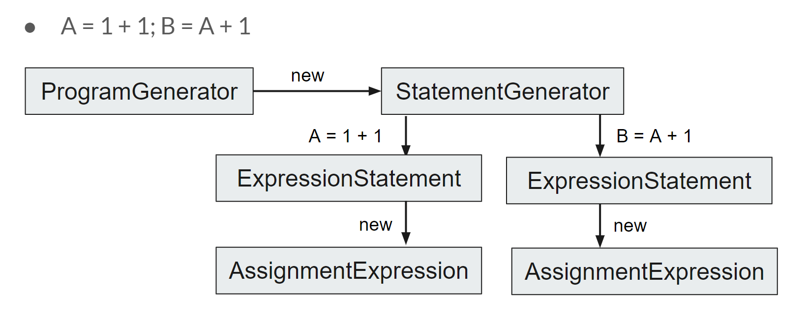

# T3 Python 

Note: Readers can open `README.html` file to read the printed version of the document.

## Content

[toc]

## Python 3 implemented in Typescript
This page outlines our work done so far in implementing the Python 3 programming language in Typescript. This documentation covers the key considerations taken when building the Parser using the Antlr4 tool, some noteworthy features of Python 3 that we have covered in our interpreter, and example use cases.

Source Code for the X-Frontend: [x-frontend-ts-ss-zlx](https://github.com/nus-cs4215/x-frontend-t3-ss-zlx)

## Why Python?
As one of the most popular programming languages in the world, Python provides a lot of benefits to programming novices and experts alike. Through implementing the language's basic grammar and some of its most commonly used standard library functions, our team has a deepper understanding and appreciation for Python.

## Usage

To build,

``` {.}
$ git clone https://<url>/x-slang.git
$ cd x-slang
$ yarn
$ yarn build
```

To add \"x-slang\" to your PATH, build it as per the above instructions, then run

``` {.}
$ cd dist
$ npm link
```

If you do not wish to add \"x-slang\" to your PATH, replace \"x-slang\" with `node dist/repl/repl.js` in the following examples.

To try out *Python* in a REPL, run

``` {.}
$ x-slang '1 * 1'
```

Hint: In `bash` you can take the `PROGRAM_STRING` out of a file as follows:

``` {.}
$ x-slang "$(< my_source_program.js)"
```

## User Manual

All supported Python syntax will be listed in User Manual

### Calculator

This Python implementation can be used as calculator. It supports both number calculation and logical calculation. The supported operators are `+` (add), `-` (minus), `*` (multiply), `/` (division), `//` (Integer division), `~` (not), `%` (mod), `**` (power), `&` (logical and), `|` (logical or), `==` (equality), `!=` (not equal), `<` (less than), `>` (larger than), `<=` (less or equal), `>=` (greater or equal), `&&` (and), `||` (or), `and`, `or`, `not`, `True`, `False`.

For example, in order to calculate 2 to the power 10, use:

```python
2 ** 10  # Get 1024
```

Calculate a number will get the number itself:

```python
10     # Get 10
```

To test whether the integer 100 can be divide by 3 or not:

```python
100 % 3 == 0 # Get False
```

### Variable Assignment and Reuse

This Python implementation supports the assignment expression. Variables that been assigned can be reused in later program. The value that being assigned can be a number, a calculator expression, or a calculator expression that variable.

For example, assign number 1 to variable a and reuse a:

```python
a = 1

a      # Get 1
```

Assign the result of 2 to the power 10 to variable b:

```python
b = 2 ** 10

b     # Get 1024
```

Assign an expression that contains variables to a new variable:

```python
a = 1
b = 2
c = a + b + 1  # Get 4
```

### Python Built-in Data structures: Lists & Dictionaries

This Python implementation supports two Python basic built-in data structures: List and Dictionary. User can use square bracket subscripts to get elements of a list or dictionary

For example, define a list of [1, 2, 3, 4]

```python
arr = [1, 2, 3, 4]
arr[2]              # Get 3
```

Defines a mapping dictionary between strings:

```python
dictionary = {
    "hello": "Hello, World!",
    "bye": "Goodbye!"
}
dictionary["hello"]      # Get "Hello, World!"
```

### Python Built-in Functions

We have implemented two very commonly used built-in functions for Python - `print` and `range`. To implement these we took note of how standard library functions are implemented in *js-slang* to guide us.

#### `print` Function

The implementation of the print function involves evaluation the argument list of the function. 

Examples:

``` python
print("Hello, World")  # Get "Hello, World"

print(1 + 2)           # Get 3

a = 1
print(a)               # Get 1
```

#### `range` Function

The `range` function in python takes in a stop value as a required value and an optional start and step values in order to return a list of numbers. If the stop is not specified it defaults to 0 and if the step is not specified it defaults to 1.

In our implementation we have altered this function slightly in order to take in 2 required fields: the start and the stop.

Examples:


``` python
print(range(0, 5))    # Get [0, 1, 2, 3, 4]
```

### Loops

This Python implementation supports `for` loops and `while` loops in Python. 

#### For Loop

For loop will iterate every element of the given list. In each iteration, for loop will execute the body program once.

```python
arr = [1, 2, 3, 4, 5]
a = 0
for i in arr:
    a = a + i

print(a)  # Get 15 
```

Range function is usually used in for loop:

```python
b = 0
for i in range(1, 6):
    b = b + i

print(b)   # Get 15
```

#### While Loop

While loop tests an expression in every iteration. If the expression testing result is not False or 0, the while loop will execute its body program once and test the testing expression again before the next execution. The cycle will not stop until the testing result is False or 0.

For example, when a is larger than 0, add count by one in each iteration:

```python
a = 5
count = 0
while a > 0:
    count = count + 1
    a = a - 1

print(count)   # Get 5
```

If the testing expression will not be False or 0 in any case, the loop will not stop except using `break` statement

```python
a = 0
while True:     # Infinite Loop
    a = a + 1

a  # Will not be executed
```

### If Statement / Conditional Statement

This implementation of Python supports `if-elif-else` statement in Python. Different part of program will be executed according to the test of testing expression

For example, we can test variable a is positive or negative:

```python
a = 2
if a > 0:
    b = "Variable a is positive"
elif a < 0:
    b = "Variable a is negative"
else:
    b = "Variable a is 0"

print(b)  # "Variable a is positive"
```

The if statement with two branches can also uses conditional expression in Python.

For example, test if 3 is larger than 2:

```python
"larger" if 3 > 2 else "smaller"     # Get "larger"
```

### Break / Continue / Pass Statement

Sometimes it is necessary to jump out of the loop or jump to next cycle of the loop. The Break / Continue statement will do that. In other cases, we do not need the program to do anything in some if branches. Then we can use Pass statement.

#### Break Statement

When break statement is being executed, the program will jump out of the loop immediately. 

For example, jump out of the infinite loop when variable a is equal to 5:

```python
a = 0
while True:
    if a == 5:
        break
    a = a + 1

print(a)    # Get 5
```

#### Continue Statement

When continue statement is being executed, the program will jump to the next cycle of the loop immediately.

For example, add 1 to variable a except the case that a is equal to 3:

```python
a = 0
for i in range(0, 5):
    if a == 3:
        continue
    a = a + 1
    
print(a)  # Get 4
```

#### Pass Statement

When pass statement is being executed, the program will not do anything:

For example, do not do anything when variable is equal to 3:

```python
a = 0
for i in range(0, 5):
    if a == 3:
        pass
    else:
        a = a + 1
    
    
print(a)    # Get 4
```

### Function Definition

This Python implementation supports to define functions with default value, return value and recursion. 

For function definition, use `def` keyword with a function name and function arguments. The return statement will return the result of its body expression

```python
def f(a, b):
    return a + b

f(2, 4)   # Get 6
```

This Python implementation also supports default value, the default value can be defined in function declaration. The arguments with default value, however, can only located in the tail of the argument list.

```python
def f(a, b = 2):
    return a + b

f(2)      # Get 4
f(2, 4)   # Get 6
f(a = 3, b = 4) # Get 7

def f(a = 2, b):   # Illeagal
    return a + b 
```

This Python implementation also supports recursion. That is, call the function itself in the function definition.

For example, a classic recursion program: factorial

```python
def fac(n):
    if n == 0:
        return 1
    else:
        return n * fac(n - 1)

fac(6)   # Get 720
```

>   One thing to note is that, all variables that defined inside function are local variables. If global variable is needed inside a function, please use `global` statement

### Variable Scoping Statements

There are two keywords implemented in Python in order to define the scope of variables. These keywords are used inside of functions. This section will detail the use of these keywords and our implementation logic.

#### Global Statement

All variables that defined inside function are local variables. It will not affect the value of the global valuables:

```python
a = 1

def changeA():
    a = 2
    return a

print(a)    # Still get 1
```

The `global` keyword allows you to modify the variable in the global scope, i.e. the function body scope It is used to modify a global variable and make changes to the variable in a local context, which changes the value of the variable globally.

Example:

``` python
a = 1
def changeA():
    global a
    a = 2
changeA()
print(a)    # Get 2
```

#### Nonlocal Statement

Another method to make the scoping of variables larger is using nonlocal statement.

The `nonlocal` keyword allows you to modify the variable in the parent scope of the current scope, i.e. the function body scope It is used to modify a variable located in the parent environment frame and make changes to the variable in a local context, which changes the value of the variable in the parent environment frame.

Example:

``` python
a = 1
def f():
    a = 2
    def g():
        nonlocal a
        a = 3
    g()
    return a
f()   # Get 3
a     # Get 1
```

### Python For Loops 

The Python `for` loops are slightly different to the Javascript `for` loops, and bear more resemblance to the JS `forEach` function.

Essentially Python for loops consist of an iterator, an interated value and finally the for loop body. In every iteration of the for loop body, the iterator takes on the next value of the iterated and the loop body is performed. The final value of the iterator is retained in the current environment frame. 

Examples:

```python
arr = [1, 2, 3, 4, 5]
for i in arr:
    do something...

for i in range(1, 6):
    do something...
```

### Python Built-in Data structures: Lists & Dictionaries

We have implemented two of the basic Python built-in data structures - lists and dictionaries. User can use square bracket subscripts to get elements of a list or dictionary

Examples:

```python
arr = [1, 2, 3, 4]
print(arr[2])

dictionary = {
    "hello": "Hello, World!",
    "bye": "Goodbye!"
}
print(dictionary["hello"])
```

### Visualising the Environment 

For visualising the environment, our initial plan was to follow the environment visualiser in `cadet-frontend`. However we were unable to successfully integrate it - anytime a program was run with a breakpoint set, it would cause the frontend to error out.

We decided to try developing the environment visualiser with a different approach by applying what we had learnt when implementing the Python built-in functions. We created a new built-in function `env()` in order to return the environment at that point in the program's execution. This works very similarly to the debbuger + environment visualiser tools that are used in the source-academy frontend.

This function loops through the Context and seperates the different frames into that for the program (i.e. the global environment), and the function environments (if the `env()` function is called inside a function body). This function is especially useful when used in combination with the use of Python keywords.

Example 1:

``` python
    a = 1
    b = 2
    def f():
        c = 3
        return env()
    f()

>>> {"f": {"c": 3}, "program": {"a": 1, "b": 2, "f": "function declaration"}}
```

Example 2:

``` python
    a = 1
    b = "hello"
    def f():
        global a
        a = a + 7
    f()
    env()

>>> {"program": {"a": 8, "b": "hello", "f": "function declaration"}}
```

## Developer Manual


### Parsing Tool: Antlr4ts

Antlr4 is a useful parsing tool for grammar analysis. In this project, because our develop language is TypeScript, we used Antlr4ts, which is the TypeScript version of the Antlr4, to parse the input program.

#### Grammar File

Antlr4 will parse the program based on the grammar that defined in g4 file. We combined two Python syntax g4 files: https://github.com/antlr/grammars-v4/blob/master/python/python3-ts/Python3.g4 and https://github.com/antlr/grammars-v4/blob/master/python/python3-js/Python3.g4. 

Then we can apply Antlr4ts based on our Python3.g4 file. Four new files will be generated: Python3Lexer, Python3Parser, Python3Listener and Python3Visitor.

#### Python3Lexer

In file Python3Lexer, Antlr4ts will analyze every word in the input program, and define key words and generate Indent / Dedent Tokens. After that, the parser will be able to parse the program based on different kinds of elements and Tokens.

#### Python3Parser

In file Python3Parser, a tree will be established. Every grammar rule in Python3.g4 file will become a Tree Node and their relationship between each other will be defined. After that, the Listener and the Visitor will be able to understand program based on the Python3 grammar.

#### Python3Listener

Python3Listener provides methods to go in and go out of the tree node, so that Visitor will be able to go through the whole tree structure using these methods.

#### Python3Visitor

Python3Visitor provides methods for programmers to go through every tree node and methods to look at its child node. After that, the programmers can define the return data structure of the parsing result. In our implementation, Python3Visitor will be extended into several Generator Classes

### Generator Classes

There are totally four different classes that generated from the class Python3Visitor. We can divide them into three kinds: Program Generator, Statement Generator and Expression Generator & Expression List Generator. 

-   Program Generator returns a program, whose body is a list of statements.
-   The Statement Generator generates several statements, whose body is an expression or a list of expression.
-   The Expression Generator generates an expression and the Expression List Generator generates a list of expressions.

For example, for the specific program `A = 1 + 1; B = A + 1` . A program generator will return the parsing result, its body will create a Statement Generator using "new" method. For the Statement Generator generated by Program Generator, it will recognize that this program consists of two Expression Statements. So the Statement Generator will generate two Expression Statements. And for each Expression Statements, it will generate an Assignment Expression using new method. The Assignment Expression will also create new Expression Generators so that the Binary Expression will be generated through these Expression Generators. Through these method, the difference between Statement and Expression will be clear and the parsing process will be more organized



### Indent & Dedent Tokens

One of the important Python characteristic is that Python do not use brace blocks and it separate blocks by indentation. This is a tricky problem, as there is no obvious symbol for parser to separate the blocks. So, one of the Python3Lexer's task is to generate INDENT and DEDENT tokens. In our implementation, the INDENT token should be generated after every Compound Statement Colon. The DEDENT token should be generated after block is finished. When there are multiple blocks finish together, multiple DEDENT tokens will be generated.

For example, the tokens should be generated like:

```python
def f(a):          {INDENT}
    if a > 0:      {INDENT}
        a = a + 1  {DEDENT}
    else:          {INDENT}
        a = a - 1  {DEDENT} {DEDENT}
f(3)
```

In order to generate INDENT & DEDENT tokens correctly, an algorithm is needed:

-   Initially, an indentation stack is defined as `IS = [ 0 ]`
-   Every time when there is a new line:
    -   Firstly pairing the braces, brackets and parentheses, so that we can make sure it is not inside a function application code.
    -   Then we can get the indentation number N: 
        -   If N == head(IS), then do nothing
        -   If N < head(IS), then pop IS M times until N is equal to head(IS), and generate M DEDENT tokens
        -   If N > head(IS), push N into IS and generate an INDENT token

Through this algorithm, the INDENT & DEDENT tokens can be correctly generated so that the parsing tool can work normally.

### Parsing Result

Here are two examples of parsing result:

The list declaration:

```python
a = [1, 3]

# Parsing Result:
'''
{
  type: 'Program',
  sourceType: 'script',
  body: [
    {
      type: 'BlockStatement',
      body: [
        {
          type: 'ExpressionStatement',
          expression: {
            type: 'AssignmentExpression',
            operator: '=',
            left: { type: 'Identifier', name: 'a' },
            right: {
              type: 'ArrayExpression',
              elements: [
                { type: 'Literal', value: 1 },
                { type: 'Literal', value: 3 }
              ]
            }
          }
        }
      ]
    }
  ]
}

'''
```

The If Statement:

```python
if True:
    pass

# Parsing Result:
'''
{
  type: 'Program',
  sourceType: 'script',
  body: [
    {
      type: 'IfStatement',
      test: { type: 'Literal', value: true, raw: 'True' },
      consequent: {
        type: 'BlockStatement',
        body: [
          {
            type: 'BlockStatement',
            body: [ { type: 'PassStatement' } ]
          }
        ]
      },
      alternate: { type: 'EmptyStatement' }
    }
  ]
}
'''
```

### Environment in Python3

Much like the environment in Source, our implementation of the environment in Python is a stack of frames. The variables that stored in the current frame is called local variable and the the variables that stored in the base frame (global frame) is called global variables. When a variable is needed, the interpreter will firstly look for the variable at the current frame. If the variable is not found, search the variable in the parent environment frame. This process should be repeated until the base frame. If the variable is still not found, then the interpreter will report error "variable is not defined".

For function application in Python3, the interpreter will create a new empty frame for the function. This frame will be deleted after the function application. That's why all the variables defined in function will be the local variable. There are however other ways the environment can be changed, i.e. by using the python specific `global` and `nonlocal` keywords.

### Python Loops 

#### Loops Implementation

In our implementation, Python while loops are evaluated using a Typescript while loop, where as long as the condition is satisfied the while loop body is evaluated again. Python for loops are a bit different to for loops in Typescript, their functionality is more similar to that of the forEach function in Typescript. A for loop in Python involves an iterator, an iterated value and a function body. For every iteration of the for loop, the iterator will be assigned with the next value in the iterated before the for loop body is evaluated.

#### Break / Continue Statement in Loop

We have also implemented break and continue statements to be used in Python loops. Break statement returns a `BreakValue` object and a continue statement returns a `ContinueValue` object. Whenever a blockstatement evaluates to `BreakValue` or a `ContinueValue` the current cycle of the loop stops. If its a `BreakValue` then the loop is exited and if its a `ContinueValue` then the next iteration begins.

### Function Declaration & Application

When a function is declared, we assign the whole declaration node into the current environment frame using the name of the function as the identifier. When a function is applied, we get the assigned declaration from the environment. Then we create an empty a new empty frame for the function body and we push it onto the environment. In the function body if a block statement evaluates to a return value we end evaluation of the function body and return the value. Once the function body has returned the final value, we check the global list and nonlocal list and then finally pop the function body frame off the environment stack.

### Variable Scoping Statements

#### Global Statement

The logic we have used to implement this keyword is as follows:

1. Assign variable names inside globallist (which is inside the Program Frame) as local list variable “global” in current frame
2. Check local variable “global” before function finishes
3. If the list “global” exists ->  Copy the names and their values in the list “global” into Program Frame
4. If the list “global” does not exist -> Pass

#### Nonlocal Statement

The logic we have used to implement this keyword is as follows:

1. Assign variable names in nonlocallist as local list variable “nonlocal” in current frame
2. Check local variable “nonlocal” before function finishes
3. List “nonlocal” exists ->  Copy the names and their values into tail frame
4. List “nonlocal” not exists -> Pass


## Testing

There are several test case in `/test` folder. Tester can copy the code to the local source academy and execute the program.

Error messages
--------------

To enable verbose messages, have the statement `"enable verbose";` as the first line of your program.

There are two main kinds of error messages: those that occur at runtime and those that occur at parse time. The first can be found in `interpreter-errors.ts`, while the second can be found in `rules/`.

Each error subclass will have `explain()` and `elaborate()`. Displaying the error will always cause the first to be called; the second is only called when verbose mode is enabled. As such, `explain()` should be made to return a string containing the most basic information about what the error entails. Any additional details about the error message, including specifics and correction guides, should be left to `elaborate()`.

Please remember to write test cases to reflect your added functionalities. The god of this repository is self-professed to be very particular about test cases.

Using your x-slang in local Source Academy
-------------------------------------------

A common issue when developing modifications to x-slang is how to test it using your own local frontend. Assume that you have built your own x-frontend locally, here is how you can make it use your own x-slang, instead of the one that the Source Academy team has deployed to npm.

First, build and link your local x-slang:
``` {.}
$ cd x-slang
$ yarn build
$ yarn link
```
Then, from your local copy of x-frontend:
``` {.}
$ cd x-frontend
$ yarn link "x-slang"
```

Then start the frontend and the new x-slang will be used. 
